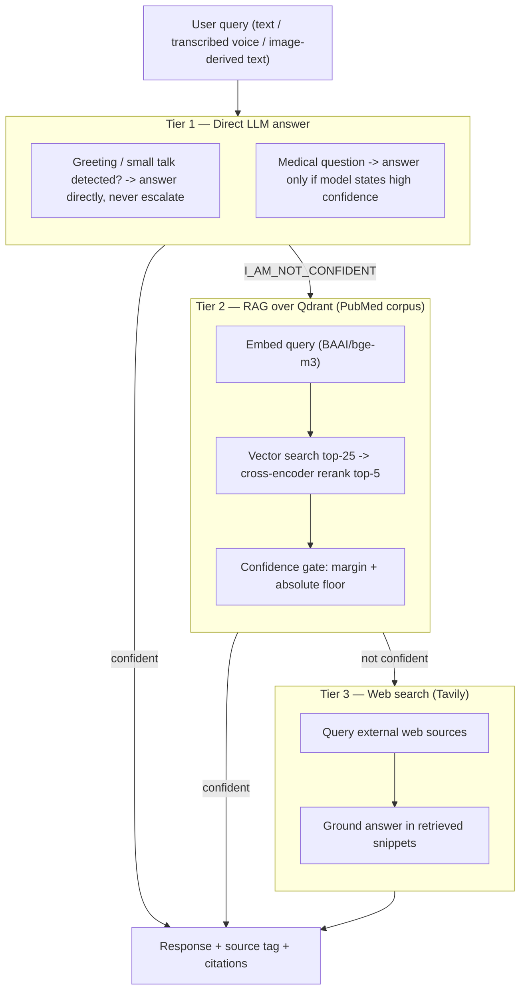
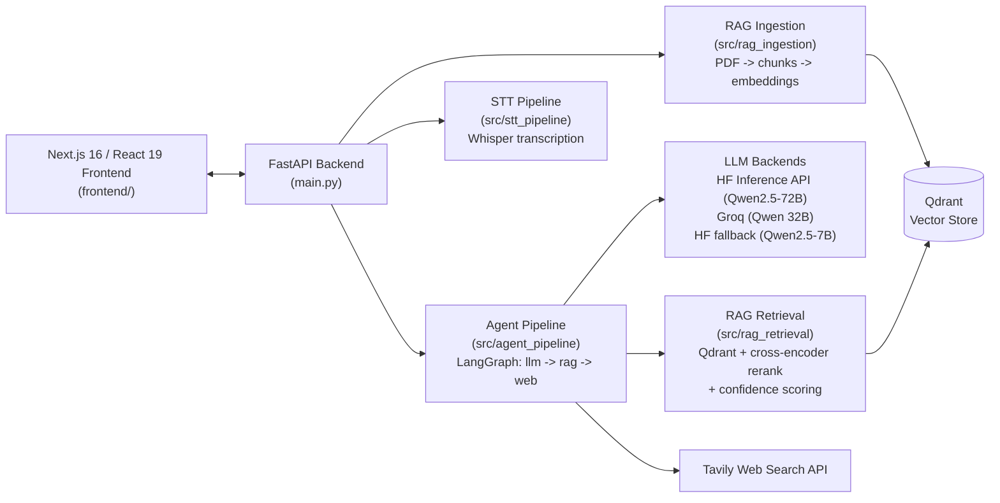
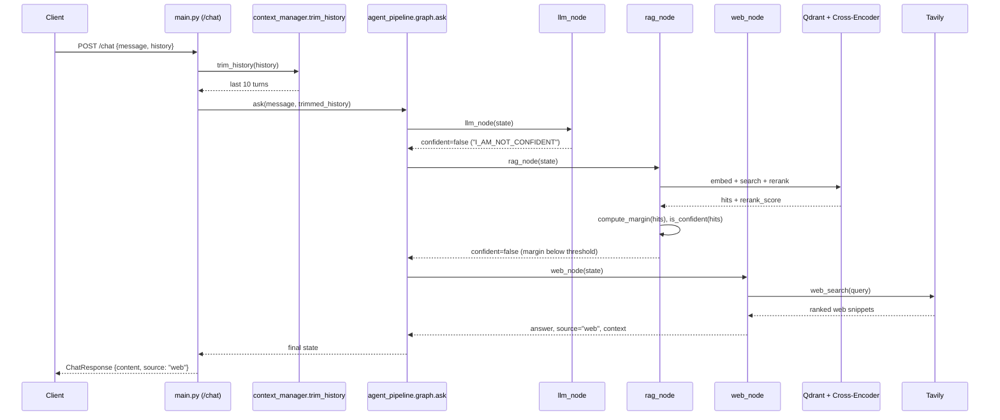
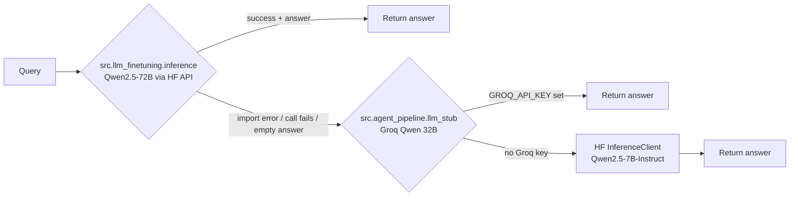

# AraCheck

AraCheck (internally named `AraDoc` in the codebase) is a bilingual (Arabic/English) medical information assistant built around a tiered, agentic retrieval pipeline rather than a single LLM call. It answers questions through text, voice, or images, and grounds its answers in retrieved medical literature and web search when its own parametric knowledge is not sufficient, instead of letting the model answer from memory alone in a domain where hallucination is unacceptable.

This document describes what is actually implemented in this repository: the architecture, the reasoning behind each design decision, the API surface, how to run the system, and its current limitations. Nothing below is aspirational; every claim is tied to a specific file and function in the codebase.

## Table of Contents

1. [Problem and Approach](#1-problem-and-approach)
2. [System Architecture](#2-system-architecture)
3. [Request Lifecycle](#3-request-lifecycle)
4. [Retrieval and Confidence Scoring](#4-retrieval-and-confidence-scoring)
5. [LLM Backend Chain](#5-llm-backend-chain)
6. [Optional Fine-Tuning Pipeline](#6-optional-fine-tuning-pipeline)
7. [Repository Structure](#7-repository-structure)
8. [Design Decisions](#8-design-decisions)
9. [Technology Stack](#9-technology-stack)
10. [API Reference](#10-api-reference)
11. [Running the Project](#11-running-the-project)
12. [Testing and Evaluation](#12-testing-and-evaluation)
13. [Known Limitations](#13-known-limitations)
14. [Roadmap](#14-roadmap)
15. [Medical Disclaimer](#15-medical-disclaimer)
16. [License](#16-license)

---

## 1. Problem and Approach

A general-purpose LLM asked a medical question will answer confidently whether or not it actually knows the answer. In a medical context this is the failure mode that matters most. AraCheck addresses it with a three-tier escalation pipeline implemented as a LangGraph state machine (`src/agent_pipeline/graph.py`), where each tier is only consulted if the previous one explicitly signals low confidence rather than silently guessing.



Every tier returns the same state shape (`answer`, `source`, `context`), which is what turns the escalation logic in `graph.py` into a plain conditional-edge graph rather than hardcoded branching, and is what would make adding a fourth tier (for example, a drug-interaction database) a matter of adding one node, not restructuring the pipeline.

---

## 2. System Architecture



### Component responsibilities

| Layer | Directory | Responsibility |
|---|---|---|
| API surface | `main.py`, `schemas.py`, `validation.py` | HTTP contracts, request validation, rate limiting, feature flags |
| Agent orchestration | `src/agent_pipeline/` | Tiered escalation graph, prompt assembly, image understanding |
| Knowledge ingestion | `src/rag_ingestion/` | Turning raw PDFs into searchable vector embeddings |
| Knowledge retrieval | `src/rag_retrieval/` | Querying, reranking, and scoring retrieved evidence |
| Speech | `src/stt_pipeline/` | Local Whisper transcription (audio -> text) |
| Domain fine-tuning | `src/llm_finetuning/`, `src/data_pipeline/`, `configs/` | QLoRA training pipeline, independent of the serving path |
| Client | `frontend/` | Chat UI, voice capture, citation rendering, theming |

---

## 3. Request Lifecycle

The sequence below traces an actual `/chat` call that escalates through all three tiers, showing exactly which function is invoked at each step.



Other endpoints are simpler single-hop calls: `/transcribe` goes directly to Groq's `whisper-large-v3` or local Whisper, `/analyze-image` goes directly to the vision-language model, and `/upload-pdf` runs the ingestion pipeline synchronously before responding.

---

## 4. Retrieval and Confidence Scoring

The RAG layer (`src/rag_retrieval/retriever.py`, wrapped by `src/agent_pipeline/tools/rag_tool.py`) works as follows:

1. The query is embedded with `BAAI/bge-m3` through the HuggingFace Inference API (chosen specifically so the retrieval service does not require a local GPU).
2. The top 25 candidates are fetched from Qdrant by cosine similarity.
3. Candidates are re-ranked with a cross-encoder (`cross-encoder/ms-marco-MiniLM-L-6-v2`), and the top 5 are kept.
4. A confidence decision is computed from the re-ranked scores rather than a single absolute threshold:
   - The cross-encoder score is an unbounded regression value (observed range roughly -5 to +7 on this corpus), not a probability, so a fixed cutoff such as 0.5 has no principled meaning here.
   - A **margin** is computed instead: the top-1 score minus the average of the remaining top-k scores. A large margin means the best result clearly stands out; a small or negative margin means the results are bunched together and nothing is distinctly relevant.
   - A secondary **absolute floor** check runs alongside the margin, because a set of uniformly weak or negative scores (for example, top-1 = -0.2 against a rest-average of -3.0) can produce a misleadingly large margin despite nothing being actually relevant.
5. The provisional values (`margin_threshold = 1.0`, `absolute_floor = 0.0`) were calibrated on a 12-question benchmark, which the code explicitly flags as too small a sample to be treated as final. Every confidence-scored query is logged to `logs/rag_confidence_log.jsonl` so these thresholds can be recalibrated against real usage data later.

```python
# src/agent_pipeline/tools/rag_tool.py (simplified)
def compute_margin(hits: list[dict]) -> float:
    top1 = hits[0]["rerank_score"]
    rest_avg = sum(h["rerank_score"] for h in hits[1:]) / len(hits[1:])
    return top1 - rest_avg

def is_confident(hits, margin_threshold=1.0, absolute_floor=0.0) -> bool:
    if not hits or hits[0]["rerank_score"] < absolute_floor:
        return False
    return compute_margin(hits) >= margin_threshold
```

A separate evaluation script (`src/rag_retrieval/eval_ragas.py`) measures retrieval quality on a fixed 12-question test set spanning symptom, cause/mechanism, treatment, and complication categories, reporting keyword precision and average rerank score per question.

A multi-query variant (`multi_query_search` in `retriever.py`, using LLM-generated query paraphrases fused with Reciprocal Rank Fusion) was implemented and benchmarked, but is intentionally not wired into the default path: it measured 66.7% precision against 70% for plain single-query search on the test set, while adding LLM-call latency, so it was kept in the codebase for future re-evaluation rather than deleted or shipped as the default.

---

## 5. LLM Backend Chain

The generation layer has more redundancy than a single API call, specifically to avoid a single point of failure in a user-facing service:



Both `llm_stub.py` and `llm_finetuning/inference.py` independently implement the same greeting/casual-chat short-circuit (regex pattern matching in Arabic and English) so small talk never reaches the retrieval tiers, and both enforce answering strictly in the user's own language, including translating any non-Arabic/non-English text that leaks into retrieved context (a real, observed failure mode when the underlying PubMed corpus occasionally surfaces non-English metadata).

The medical system prompt (`src/agent_pipeline/prompts.py`) is applied consistently across all three backends and enforces: no definitive diagnosis, an explicit recommendation to seek care for potentially serious symptoms, strict adherence to supplied context, numbered citations (`[1]`, `[2]`) when context is present, and an honest statement of uncertainty rather than fabrication.

---

## 6. Optional Fine-Tuning Pipeline

`src/llm_finetuning/`, `src/data_pipeline/`, and `configs/config.py` implement a separate, self-contained QLoRA fine-tuning pipeline for `Qwen2.5-3B-Instruct`, decoupled from the request-serving path described above:

| Stage | File | What it does |
|---|---|---|
| Data preparation | `data_pipeline/dataset_builder.py` | Reads a CSV/XLSX with `Question`/`Answer` columns, validates the schema, drops incomplete rows, and formats each row with the Qwen chat template |
| Model setup | `llm_finetuning/model_manager.py` | Loads the base model with 4-bit quantization (`bitsandbytes`), enables gradient checkpointing, and attaches LoRA adapters via `peft` targeting the attention and MLP projection layers |
| Training | `llm_finetuning/trainer.py` | Wraps HuggingFace `Trainer`; derives warmup steps from a ratio so they scale automatically with dataset size and effective batch size; supports resuming from a checkpoint |
| Inference | `llm_finetuning/inference.py` | Two backends: `local` (merges the trained LoRA adapter onto the base model, requires a GPU) and `api` (calls the base model through the HuggingFace Serverless API without fine-tuned weights, used for development and testing) |

This pipeline requires a GPU and a training dataset that are not included in this repository (`data/dataset_20k.csv` is expected but git-ignored, and trained model weights are excluded via `.gitignore`). It exists to produce a custom domain-adapted model; the `/chat` endpoint does not depend on it to function, since `graph.py` falls back cleanly to `llm_stub.py` when it is unavailable.

---

## 7. Repository Structure

```
AraCheck/
  main.py                    FastAPI entry point, all HTTP endpoints          (377 lines)
  schemas.py                 Pydantic request/response models                 (63 lines)
  validation.py               File upload validation (type/size limits)      (128 lines)
  settings.py                 Environment-driven settings and feature flags    (61 lines)
  context_manager.py          Chat history trimming (last 10 turns)            (42 lines)
  test_endpoints.py           Smoke tests against a running instance          (115 lines)
  Dockerfile / docker-compose.yml

  configs/
    config.py                 Fine-tuning configuration                      (203 lines)

  scripts/
    ingest_books.py            Placeholder batch-ingestion script              (13 lines)

  src/
    agent_pipeline/           Agent orchestration, prompts, image analysis   (990 lines)
      graph.py                 LangGraph state machine (llm -> rag -> web)
      llm_stub.py               Groq / HuggingFace backend, greeting detection
      prompts.py                 Medical system prompt (Arabic)
      context_builder.py         Merges history, RAG context, image context
      image_understanding.py     Vision-language image analysis
      tools/rag_tool.py            RAG interface with confidence scoring
      tools/web_search.py          Tavily web search wrapper

    rag_ingestion/            PDF -> chunks -> embeddings -> Qdrant           (230 lines)
      chunker.py, embedder.py, pdf_ingestor.py

    rag_retrieval/            Query, rerank, evaluate                        (410 lines)
      retriever.py, reranker.py, eval_ragas.py

    llm_finetuning/            QLoRA training and inference                  (625 lines)
      model_manager.py, trainer.py, inference.py

    data_pipeline/
      dataset_builder.py                                                     (153 lines)

    stt_pipeline/
      whisper_stt.py                                                          (28 lines)

    utils/
      context_manager.py         Alternate history-truncation utility         (14 lines)

  frontend/                   Next.js 16 application (19 files, ~1,770 lines)
    app/                          App Router pages
    components/                   ChatWindow, VoiceInput, Sidebar, Citation, ThemeToggle
    lib/                          api.ts (backend client + mock API), types.ts
```

Total backend Python code: **32 files, approximately 3,460 lines**, excluding generated `__pycache__` artifacts. Line counts above are current as of this document and are meant to give a realistic sense of where the complexity actually lives (the agent pipeline and the fine-tuning pipeline together account for over half the codebase).

Note: `src/rag_retrieval/reranker.py` implements a second, GPU-based reranking path using `BAAI/bge-reranker-base` directly through `transformers`, separate from the cross-encoder reranking already built into `retriever.py`'s `rerank()` function, which is what `rag_tool.py` actually calls at query time. The two are not currently unified; `reranker.py` is not on the live retrieval path.

---

## 8. Design Decisions

The table below documents the non-obvious choices in this system and why they were made, rather than leaving that reasoning implicit in code comments only.

| Decision | Alternative considered | Why this was chosen | Trade-off accepted |
|---|---|---|---|
| Margin-based RAG confidence instead of a fixed score threshold | A single absolute cutoff on the cross-encoder score | The cross-encoder output is an unbounded regression score, not a probability, so no single cutoff is meaningful across queries; the margin is self-normalizing regardless of scale | Requires at least two candidates to compute; calibrated on a small (12-question) sample, so thresholds are provisional |
| Three-tier escalation (LLM to RAG to web) instead of always retrieving | Always run RAG/web for every query | Greetings and general questions the model already knows do not need retrieval latency or cost | Adds a dependency on the LLM honestly signaling low confidence (`I_AM_NOT_CONFIDENT`); a false "confident" response skips retrieval entirely |
| Embedding queries via the HuggingFace Inference API rather than loading `BAAI/bge-m3` locally | Local model on GPU | The retrieval service needed to run on a machine without a GPU and with limited local compute | Adds network latency and an external dependency to every retrieval call |
| Groq as the primary chat LLM, HuggingFace as fallback | A single provider | Groq offered materially faster inference for the chosen Qwen model at effectively no cost during development | Two provider integrations to maintain instead of one |
| Multi-query RRF retrieval implemented but not enabled by default | Ship it as the default retrieval strategy | Benchmarked at 66.7% precision versus 70% for plain search on the 12-question set, with added LLM-call latency | The extra code path exists but is currently unused; kept for future re-evaluation on a larger test set |
| Feature flags toggled at runtime via a protected endpoint | Environment-variable-only flags requiring redeploy | Lets voice/image/PDF features be disabled instantly if a dependency (Whisper, HF, Qdrant) becomes unavailable in production | Requires securing the admin key and keeping the in-memory flag registry consistent across processes |
| Image understanding restricted to text extraction and neutral description only | Allow the vision model to describe likely conditions | A vision-language model speculating on pathology from an image is a diagnosis risk with no clinical basis | Reduces the feature's usefulness on its own; it is meant to feed the RAG/LLM layer, not replace a radiologist |

---

## 9. Technology Stack

**Backend:** FastAPI, LangGraph, Pydantic, slowapi (rate limiting), python-dotenv

**Retrieval:** Qdrant (vector store), BAAI/bge-m3 (1024-dim embeddings), cross-encoder/ms-marco-MiniLM-L-6-v2 (reranking), PyMuPDF (PDF text extraction), LangChain `RecursiveCharacterTextSplitter` (chunking)

**Generation:** HuggingFace Inference API (Qwen2.5-72B-Instruct, Qwen2.5-7B-Instruct), Groq API (Qwen 32B), Tavily (web search), zai-org/GLM-4.5V (vision-language model)

**Speech:** OpenAI Whisper (local), Groq-hosted whisper-large-v3 (remote, preferred when available)

**Fine-tuning:** peft (LoRA), bitsandbytes (4-bit quantization), HuggingFace Transformers / Datasets / Trainer

**Frontend:** Next.js 16 (App Router), React 19, Tailwind CSS 4, shadcn/ui, Radix UI, next-themes

**Infrastructure:** Docker, docker-compose

---

## 10. API Reference

| Method | Endpoint | Rate limit | Description |
|---|---|---|---|
| POST | `/chat` | 20/min | Send a message with conversation history |
| POST | `/transcribe` | 10/min | Upload audio, receive transcribed text |
| POST | `/analyze-image` | 10/min | Upload a medical image, receive extracted text and description |
| POST | `/upload-pdf` | 5/min | Upload a PDF, ingest it into the vector store |
| GET | `/flags` | none | Current feature flag states |
| PATCH | `/flags/{name}` | none | Toggle a flag (requires `x-admin-key` header) |
| GET | `/health` | none | Liveness check |

### `POST /chat`

Request:

```json
{
  "message": "What are the symptoms of type 2 diabetes?",
  "history": [
    { "role": "user", "content": "Hi" },
    { "role": "assistant", "content": "Hello, how can I help with your medical questions?" }
  ]
}
```

Response:

```json
{
  "id": "b1e6c1d2-...",
  "role": "assistant",
  "content": "[1] Common symptoms of type 2 diabetes include increased thirst, frequent urination...",
  "source": "rag"
}
```

`source` is one of `llm`, `rag`, or `web`, indicating which tier ultimately produced the answer.

### `POST /transcribe`

`multipart/form-data` with fields `file` (audio) and `language` (`ar` or `en`). Returns:

```json
{ "text": "عندي صداع من امبارح", "language": "ar" }
```

### `POST /analyze-image`

`multipart/form-data` with field `file` (image). Returns:

```json
{
  "extracted_text": "Paracetamol 500mg, twice daily",
  "visual_description": "A printed prescription note with a clinic letterhead at the top.",
  "error": null
}
```

### `PATCH /flags/{name}`

Header: `x-admin-key: <ADMIN_SECRET_KEY>`

```json
{ "enabled": false }
```

---

## 11. Running the Project

### Requirements

- Python 3.10 or later
- Node.js 18 or later
- A Qdrant instance (Qdrant Cloud or self-hosted)
- API keys: `GROQ_API_KEY`, `HF_TOKEN`, `TAVILY_API_KEY`, `QDRANT_URL`, `QDRANT_API_KEY`

### Backend

```bash
git clone https://github.com/nour-hatem/AraCheck.git
cd AraCheck

python -m venv venv
source venv/bin/activate        # On Windows: venv\Scripts\activate

pip install -r requirements.txt
```

Create a `.env` file in the project root:

```env
GROQ_API_KEY=your_groq_key
GROQ_MODEL=qwen-qwq-32b
HF_TOKEN=your_huggingface_token
TAVILY_API_KEY=your_tavily_key

QDRANT_URL=https://your-cluster.qdrant.io
QDRANT_API_KEY=your_qdrant_key

ALLOWED_ORIGINS=http://localhost:3000
ADMIN_SECRET_KEY=change-this-secret

ENABLE_VOICE_INPUT=true
ENABLE_PDF_INGESTION=true
ENABLE_IMAGE_ANALYSIS=true
```

Run:

```bash
python main.py
# or
uvicorn main:app --reload --port 8000
```

Served at `http://localhost:8000`, with interactive API documentation at `http://localhost:8000/docs`.

### Frontend

```bash
cd frontend
npm install
cp .env.example .env.local     # set NEXT_PUBLIC_API_URL
npm run dev
```

Served at `http://localhost:3000`. Setting `NEXT_PUBLIC_USE_MOCK_API=true` runs the UI against a local mock response generator (`frontend/lib/api.ts`) without a backend — useful for isolated frontend development or a demo with no live API keys.

### Docker

```bash
docker-compose up --build
```

The current `docker-compose.yml` references build paths (`./backend`, `./AraCheck-frontend/AraCheck-frontend/frontend`) that do not match this repository's actual layout, where the backend lives at the repository root and the frontend is at `./frontend`. Correct these to `build: .` for the backend service and `build: ./frontend` for the frontend service before running `docker-compose up`.

---

## 12. Testing and Evaluation

**API smoke tests** (`test_endpoints.py`) exercise `/health`, `/flags`, input validation on `/chat` (empty and oversized messages), and the full flag-toggle flow with and without the admin key, against a running instance on port 8001:

```bash
python test_endpoints.py
```

**Retrieval quality evaluation** (`src/rag_retrieval/eval_ragas.py`) runs the 12-question benchmark and reports keyword precision and average rerank score per category:

```bash
python -m src.rag_retrieval.eval_ragas
```

Both are deliberately lightweight, fixed test sets rather than large held-out benchmarks; scaling both suites is listed under Roadmap.

---

## 13. Known Limitations

This section is included deliberately, as an accurate account of the current state of the system:

- The RAG confidence thresholds (`margin_threshold = 1.0`, `absolute_floor = 0.0`) are provisional, calibrated on only 12 test questions, and are explicitly intended to be recalibrated once `logs/rag_confidence_log.jsonl` accumulates real production queries.
- Two independent reranking implementations exist (`retriever.py`'s built-in cross-encoder rerank and the separate `reranker.py` module); only the former is on the live query path.
- `docker-compose.yml` has build paths that do not match the current repository layout.
- `scripts/ingest_books.py` is a placeholder and does not yet perform real ingestion logic.
- The fine-tuning pipeline is decoupled from the serving path: it requires a GPU and a training dataset not shipped in this repository.
- The multi-query RRF retrieval variant is implemented and benchmarked but not enabled by default, since it did not outperform single-query search on the available 12-question test set.
- Both test suites (endpoint smoke tests and retrieval evaluation) run against small, fixed sets rather than large held-out data.

---

## 14. Roadmap

- Recalibrate RAG confidence thresholds against real query logs once sufficient production data is available in `logs/rag_confidence_log.jsonl`.
- Unify the two reranking implementations into a single configurable module.
- Correct `docker-compose.yml` build paths and add a CI job that builds both images on every push.
- Expand the retrieval evaluation set beyond 12 questions, and re-evaluate `multi_query_search` against it before deciding whether to enable it by default.
- Implement the batch PDF ingestion logic in `scripts/ingest_books.py`.
- Add structured logging/tracing across tier escalation to make it possible to audit, per request, exactly why the system escalated (or did not) from one tier to the next.

---

## 15. Medical Disclaimer

AraCheck is an informational assistant only. It is not a substitute for professional medical consultation, clinical diagnosis, or emergency services. The system prompt (`src/agent_pipeline/prompts.py`) explicitly constrains the model to avoid presenting any conclusion as a final or definitive diagnosis, to recommend immediate medical care when described symptoms are potentially serious, to rely only on supplied context rather than fabricating facts or sources, and to state clearly when its confidence in an answer is low.

---


## 16. License

Licensed under the [Apache License 2.0](LICENSE).
